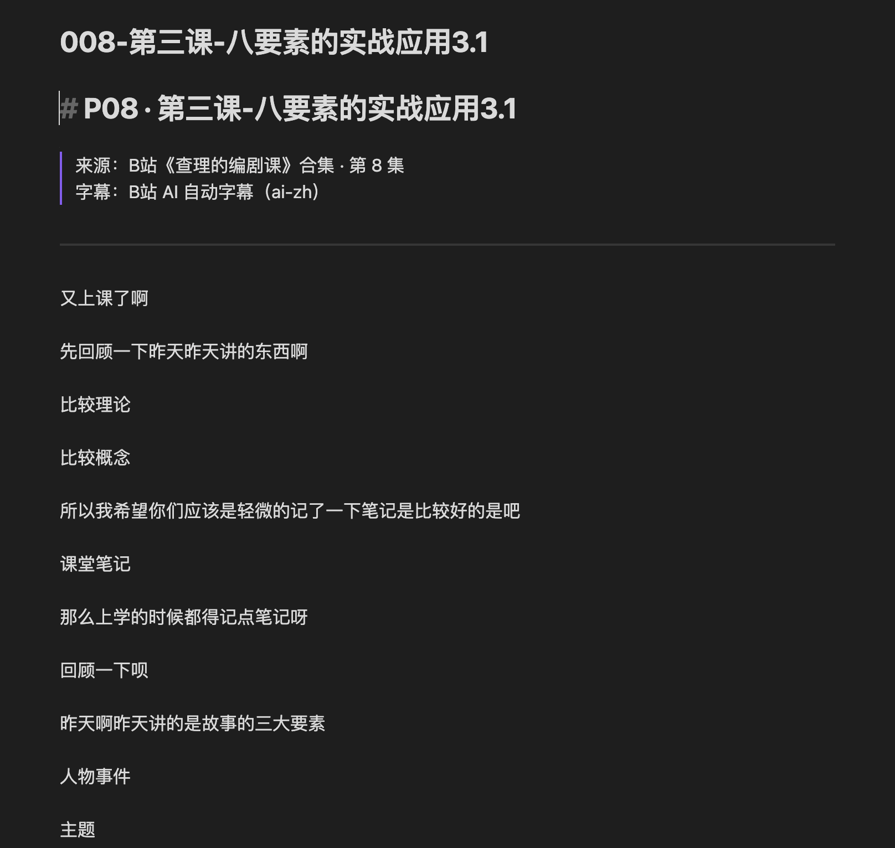
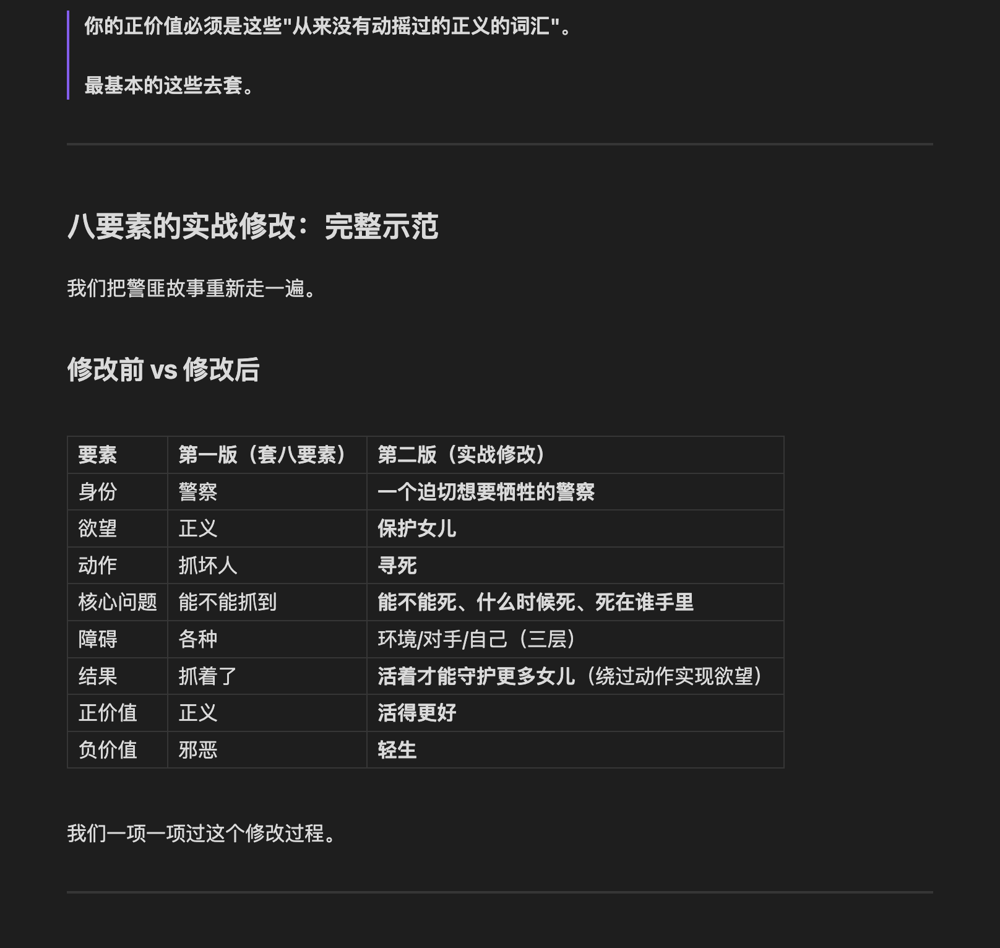
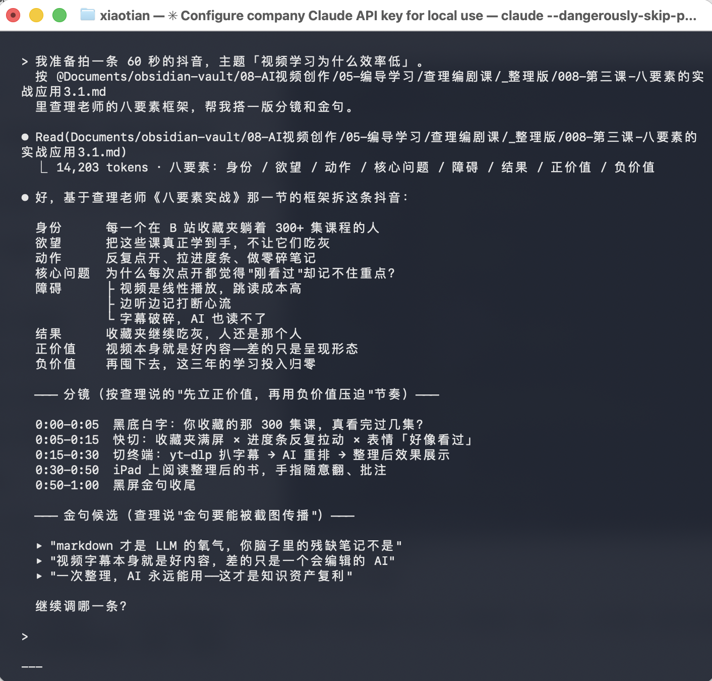
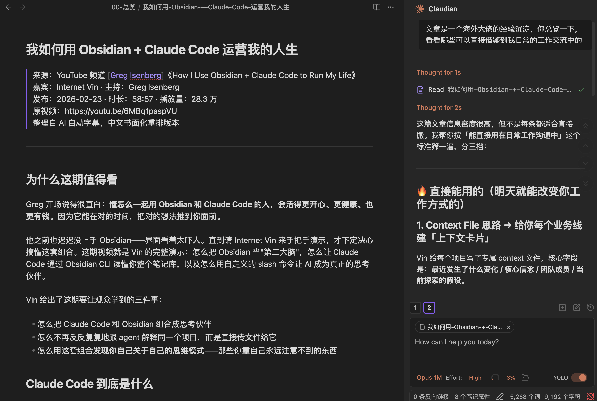

# videos-to-book

> 把视频课程/访谈/讲座变成**人可读的书**，也是 **AI 可引用的知识燃料**。
> yt-dlp 抓字幕 + AI 重排为结构化 markdown + 多出口适配器（本地/Obsidian/飞书/Notion）。

[🇬🇧 English README.en.md](./README.en.md)

## 完整流水线一图看懂

### ① 输入：任意平台的视频课程 / 访谈 / 讲座

| B 站课程（查理编剧课·91 集） | YouTube 访谈（Greg Isenberg × Internet Vin） |
|---|---|
|  |  |

### ② 整理：字幕机械转 → AI 结构化重排

| 整理前（AI 字幕机械转换） | 整理后（AI 书面化重排） |
|---|---|
|  |  |

保留讲师 100% 的原话和风格，只重构呈现方式——章节、金句块、对比表格全部自动生成。

### ③ 真正的杠杆：AI 直接引用整理后的课，用于实际生产

这才是这个项目的灵魂——**整理好的 markdown 不止是给人读，是给 AI 当方法论用**。

<table>
<tr>
<th width="50%">编导课 → 做抖音视频（八要素直接套用）</th>
<th width="50%">Obsidian 课 → AI 给出可立刻改变工作方式的建议</th>
</tr>
<tr>
<td width="50%"></td>
<td width="50%"></td>
</tr>
</table>

左图：Claude Code 读完整理后的《查理编剧课·第三课·八要素》，直接按框架（身份/欲望/动作/核心问题/障碍/结果/正价值/负价值）帮写抖音分镜和金句。
右图：Obsidian 里的 Claudian 插件读完整理后的《Obsidian × Claude Code》访谈长文，直接给出"明天就能改变你工作方式"的可执行建议。

**一次整理，AI 永久可用**。这就是"视频 → 书"真正的价值。

## ⭐ 双重价值（关键定位）

把视频课程整理成结构化 markdown，**对人是"可读的书"，对 AI 是"可引用的知识燃料"**——这是两个维度的价值，**后者可能比前者更重要**。

### 对人：学习效率
- 可跳读、可检索、可永久归档
- 金句 + 章节 + 表格让知识密度倍增
- 笔记软件（Obsidian / 飞书文档 / Notion）里可形成双向链接

### 对 AI：知识供给（真正的杠杆）

markdown 是 **LLM 的"氧气"**——破碎的口语字幕不是，结构化的书才是。整理好的课程 md 可以让 AI **直接引用课程的思路和方法论**，应用到你实际的生产环节：

| 场景 | AI 怎么用这门课 |
|---|---|
| **做工具** | 让 Claude Code 按[产品经理课的思路]帮你设计新工具 |
| **做视频 / 写剧本** | 让 AI 按[编剧课八要素]帮你拆爆款或写新脚本 |
| **做营销 / 写文案** | 让 AI 按[营销课的框架]帮你写拉新文案、直播话术 |
| **做决策 / 评估项目** | 让 AI 按[商业课/投资课的思路]帮你评估新机会 |
| **做咨询 / 回答** | 让 AI 引用[某位大牛的整套观点]回答用户问题 |

**实际用法**：
- 把生成的 .md 扔进 Obsidian vault，Claude Code 通过 Obsidian CLI 可以 reference 整个课程库
- 作为 prompt 的一部分：`@[某课程.md] 基于这门课的思路帮我做 X`
- 传给 OpenClaw / Claudebot / 任何 agent 作为长期知识储备

**一次整理，永久复用**。一门优质课整理后，它的思维方式就变成了你 AI 工具链的一部分——比你看一遍记在脑子里的残缺版本，**AI 引用得更全面、更快、更准**。

## 这是什么 · Why this exists

视频学习有三个老问题：
1. **跳着看找不到重点**——想复习某个知识点要反复拉进度条
2. **做笔记太累**——边听边记容易漏，记完没上下文
3. **回头复习全忘**——视频没有可检索的文本

而 AI 时代还多了一个问题：**你收藏的那些好课，AI 其实"读不到"**——视频文件 AI 不看，破碎字幕 AI 理解不了，你脑子里的残缺笔记 AI 也用不上。

市面上已有的工具要么只下载（yt-dlp），要么只做摘要（Eightify/Glarity，SaaS 且只出精简版），**"保留讲师完整原话 + 按语义结构化重排 + 书籍式可读 + AI 可引用"这个定位目前没有成熟开源方案**。

本项目填这个坑。核心假设：**视频字幕本身就是好内容的原料，只需要一个懂"删口语+补标点+归纳结构+保留个性"的编辑**。AI 是这个编辑，**产出的东西既给人看也给 AI 用**。

## 它能干什么 · Scope

**支持**：
- 🎓 **单门课程** → 书（如 B 站某编剧课 91 集 → 可读长书）
- 🌏 **英文视频** → 中文书（如 Lex Fridman 访谈 → 中文长文）
- 📊 **创作者频道** → 周报（如 10 个 YouTube AI 博主 → 每周情报摘要）

**支持的站点**（继承自 yt-dlp）：B 站 / YouTube / Vimeo / TikTok / Twitch / 1700+ 站点

**不做的事**：
- ❌ 不做视频摘要（已有一堆工具）
- ❌ 不下载视频文件本身（只抓字幕+元数据）
- ❌ 不搞反爬黑魔法（站点不支持就不支持）

## 快速开始 · Quickstart

### 前置依赖
```bash
# 1. 安装 yt-dlp
pip install yt-dlp

# 2. 浏览器登录 B 站/YouTube（cookie 会自动从浏览器读）

# 3. clone 本项目
git clone https://github.com/YOUR_USERNAME/videos-to-book.git
cd videos-to-book
pip install -r requirements.txt

# 4. 复制配置文件
cp config.example.yaml config.yaml
# 编辑 config.yaml 按注释改你需要的部分
```

### 三种典型用法

#### 场景 1：B 站课程转书（A1）
```bash
# 抓 91 集字幕到本地
python core/fetch.py --url "https://www.bilibili.com/video/BV1eE411F73t" --out ./tmp/charlie

# 用 Claude Code 让 AI 重排（读 SKILL.md 交互式执行）
claude
> 帮我把 ./tmp/charlie/ 里的 srt 文件按 prompts/zh-lecture-to-book.md 的规则重排成书籍式 markdown，输出到 ./output/
```

#### 场景 2：英文访谈转中文书（A2）
```bash
python core/fetch.py --url "https://www.youtube.com/watch?v=XYZ" --out ./tmp/lex
claude
> 按 prompts/en-to-zh-book.md 重排，中英双栏输出
```

#### 场景 3：创作者情报周报（B4）
```bash
# 批量抓最近一周的新视频字幕
python core/fetch.py --channels config/channels.yaml --since 7d --out ./tmp/weekly

# 生成周报
claude
> 按 prompts/creator-weekly.md 生成本周 AI 创业者动态周报，走 lark adapter 发到飞书群
```

## 核心设计 · Architecture

```
          字幕抓取              AI 重排                 出口
        ┌─────────┐          ┌─────────┐          ┌──────────┐
  URL ─▶│ yt-dlp  │──srt──▶ │ 重排引擎 │──md──▶ │ 多出口选  │
        └─────────┘          └─────────┘          │          │
                                  ↑                │  local   │
                             prompt 模板库         │  obsidian│
                                                   │  飞书    │
                                                   │  notion  │
                                                   └──────────┘
```

- **core/**：抓取 + 清洗（纯 Python，无 AI 依赖）
- **prompts/**：AI 重排的 prompt 模板（核心 know-how）
- **adapters/**：不同出口（可插拔，按 config 启用）
- **skills/**：Claude Code skill 格式，直接交互式调用

## 目录结构 · Layout

```
videos-to-book/
├── core/
│   ├── fetch.py              # yt-dlp 封装（抓字幕/元数据）
│   ├── srt2md.py             # srt → 粗 markdown
│   └── restructure.py        # 调用 AI 重排（可选，直接用 SKILL 更简单）
├── prompts/
│   ├── zh-lecture-to-book.md # 中文讲课 → 书（核心，已在 91 集实战）
│   ├── en-to-zh-book.md      # 英文 → 中文书
│   └── creator-weekly.md     # 创作者周报
├── adapters/
│   ├── local.py              # 默认出口：本地 md 文件 ✅
│   ├── obsidian.py           # 写入 Obsidian vault ✅
│   ├── lark.py               # 创建飞书云文档 + 可选群通知 ✅
│   └── notion.py             # 写入 Notion（TODO）
├── skills/
│   └── videos-to-book/
│       └── SKILL.md          # Claude Code skill 入口
├── examples/
│   └── P03-查理编剧课-劝学.md  # 中文讲课样板（来自 91 集实战）
├── config.example.yaml
├── requirements.txt
└── README.md
```

## 样板产出 · Samples

`examples/` 下有三份真实跑通的样板，覆盖三种典型场景：

| 场景 | 样板文件 | 用的 prompt |
|---|---|---|
| 中文讲课转书（A1） | `examples/P03-查理编剧课-劝学-样板.md` | `prompts/zh-lecture-to-book.md` |
| 英文访谈 → 中文长文（A2） | `examples/youtube-Greg-Isenberg-Obsidian-Claude-Code-样板.md` | `prompts/en-to-zh-book.md` |
| 中文对谈节目整理（A1 变体） | `examples/bilibili-一麦三连-EP17-快乐-样板.md` | `prompts/zh-lecture-to-book.md` |

核心目标不是"短"，是"好读"。看样板能直观理解重排效果。

**粗暴对比**——原始字幕（机械转换）：
```
你知道这个学学习这件事
就是我跟你们说啊
其实没那么简单你想想看对吧
```
**重排后**：
```markdown
### 学习没那么简单

学习这件事其实没那么简单。你想想看。
```

## 使用我们自己的样板 prompt？

`prompts/zh-lecture-to-book.md` 是我们跑了 91 集《查理的编剧课》B 站课程 + 多期 B 站 / YouTube 访谈视频打磨出来的。**你可以直接用，也可以改成你领域的风格**（技术分享、商业访谈、学术讲座格式都不一样）。

## 已知陷阱 · Known Pitfalls

我们在测试过程中踩到的坑，先写这里免得你也踩。

### 1. B 站字幕需要 Chrome 登录态

```
WARNING: Subtitles are only available when logged in
```

**触发**：Chrome B 站 cookie 过期或从未登录。
**修复**：打开 Chrome，登录 bilibili.com，重跑脚本。
**备选**：用 "Get cookies.txt LOCALLY" 浏览器插件导出 cookies.txt，用 `yt-dlp --cookies path/to/cookies.txt` 参数。

### 2. Python 3.9 兼容性

本项目**已兼容 Python 3.9**（macOS 默认 python3）。所有文件都加了 `from __future__ import annotations`。如果你自己加文件，记得别用 PEP 604 的 `str | None` 语法（需 3.10+），用 `Optional[str]`。

### 3. 同一视频的多语言字幕会同名冲突

YouTube 经常同时提供 `.en.srt` 和 `.zh-Hans.srt`。srt2md 已经把输出命名成 `<stem>__<lang>.md` 避免互相覆盖（v0.1.x 早期版本会覆盖，现已修复）。

### 4. 飞书 bot 需要 docx:document 权限

lark adapter 现在是**创建飞书云文档**（不是发聊天消息），bot 需要在飞书开放平台**开通 `docx:document` 权限**。没有权限会报：

```
Access denied. One of the following scopes is required:
[docx:document, docx:document:create]
```

开通链接：`https://open.larkoffice.com/app/<你的 app_id>/auth?q=docx:document,docx:document:create`

### 5. AI 字幕有识别错误，需要上下文修正

B 站 AI 字幕把"陈老师"识别成"程老师"、"谭老师"识别成"汤老师"——不要机械信任字幕。英文字幕同理（Claude Code 经常被识别成 Claw Code、Claudebot 等）。**prompt 里已经有"同音字修正"规则**，AI 会根据上下文自己纠错。

### 6. 1 小时以上长视频需要分段处理

单次 AI 调用有 max_tokens 限制。对于 1 小时以上长视频，建议：
- **交互式模式**：让 Claude Code 按段落逐步重排（不要一次性塞整个 srt）
- **编程式模式**：改 `core/restructure.py` 让它按段切分再调用 API

### 7. 中文路径 vs 中文文件名

yt-dlp 能处理中文路径但部分 shell 命令不能。**建议**：output 目录用英文路径（如 `./tmp/`），文件名可以是中文（yt-dlp 用视频标题做文件名，会是中文）。

---

## 贡献 · Contributing

**欢迎**：
- 新 adapter（Discord/Slack/Teams/etc）
- 新 prompt 风格（技术类、学术类、商业类）
- 新站点的 cookie 处理优化

**暂不接**：反爬绕过、代理池、SaaS 化——这些要么脏、要么超出工具定位。

## 作者 · Author

[袁啸天 · OnceLab](https://oncelab.cn) · 做 AI 时代营销工具的产品经理。
本项目是 [OnceLab](https://oncelab.cn) 基础设施开源的一部分。

## License

MIT
